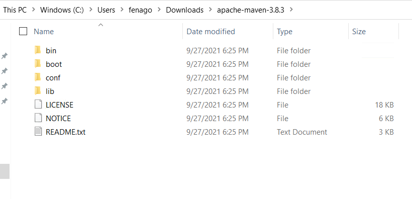
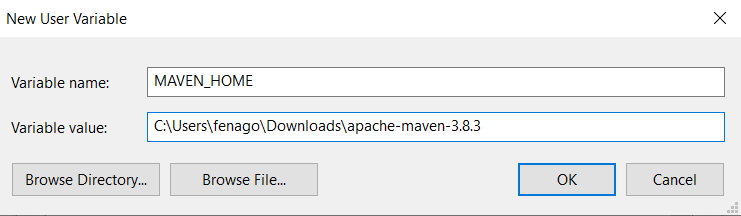

Lab: Install and Configure Maven
==================================

In this lab, we are going to highlight **how to install Maven on windows**.

[Maven](https://maven.apache.org/) is a build automation and
dependency management tool for Java based applications. To build a
project, Maven uses its [project object model
(POM)](https://maven.apache.org/guides/introduction/introduction-to-the-pom.html)
and a set of plugins.

For this lab, we will be using:

-   JDK 8
-   Maven 3.8.3
-   Windows 10

Install JDK and Set up *JAVA\_HOME*
-----------------------------------

The installation process of Apache Maven is quite simple, we just need
to extract the Maven’s zip file and set up maven environment variables.

However, Maven requires JDK to perform some important operations such as
code compilation.

So, before installing Maven on Windows 10, we need to make sure that
Java JDK is installed and the *JAVA\_HOME* environment variable is
configured on our machine.

We can type the following commands to check which JDK version is
installed on our machine:

        
            C:\Users\fenago>echo %JAVA_HOME%
            C:\Program Files\Java\jdk1.8.0_261

            C:\Users\fenago>java -version
            java version "1.8.0_261"
            Java(TM) SE Runtime Environment (build 1.8.0_261-b12)
            Java HotSpot(TM) 64-Bit Server VM (build 25.261-b12, mixed mode)

            C:\Users\fenago>
        

As we can see, the installed version of JDK is *1.8.0\_261*.

Download Apache Maven for Windows
---------------------------------

We can download Maven directly from the official website:
[https://maven.apache.org/download.cgi](https://maven.apache.org/download.cgi).
Make sure to download the latest stable release which now 3.8.3

Install Apache Maven on Windows 10
----------------------------------

Now, let’s download *apache-maven-3.8.3-bin.zip* and unzip it to a
specific folder of our choice, for example:
*C:\\Users\\fenago\\Downloads\\apache-maven-3.8.3*

Add *MAVEN\_HOME* Environment Variable
--------------------------------------

The next step is to configure the *MAVEN\_HOME* variable on Windows 10.

*MAVEN\_HOME* should point to the folder where we extracted Maven which
is *C:\\Users\\fenago\\Downloads\\apache-maven-3.8.3* in our case. Follow these
steps to add the *MAVEN\_HOME* environment variable:

1- Type **"edit"** in the Window search box, then click on the **"Edit the system environment variables"**

2- Next, select the **"Environment Variables…"** button

3- Click on the **"New…"** button and put *MAVEN\_HOME* as variable name
and *C:\\Users\\fenago\\Downloads\\apache-maven-3.8.3* as variable value

another way to set up *MAVEN\_HOME* is to use command lines. To do so,
open a new command prompt as administrator and type the following
command:

        
            C:\Windows\system32>setx /M MAVEN_HOME "C:\Users\fenago\Downloads\apache-maven-3.8.3"
            SUCCESS: Specified value was saved.
        

Add *%MAVEN\_HOME%\\bin* to *PATH*
----------------------------------

Now let’s add the last missing piece of the puzzle. This step is very
important to run the Mvn command everywhere directly from the command
prompt.

To do so conveniently, we need to edit the *PATH* variable by appending
the Maven bin folder *%MAVEN\_HOME%\\bin*.

Please bear in mind that we can accomplish the same thing using this
command line:

        
            C:\Windows\system32>setx /M PATH "%MAVEN_HOME%\bin;%PATH%"
        

Verify Mvn Installation
-----------------------

Now that we put all the pieces together, let’s test if Apache Maven is
successfully installed on Windows 10.

To verify the installation, we run:

        
            C:\Users\fenago>mvn --version
            Apache Maven 3.8.3 (05c21c65bdfed0f71a2f2ada8b84da59348c4c5d)
            Maven home: C:\Users\fenago\Downloads\apache-maven-3.8.3\bin\..
            Java version: 1.8.0_261, vendor: Oracle Corporation, runtime: C:\Program Files\Java\jdk1.8.0_261\jre
            Default locale: en_US, platform encoding: Cp1252
            OS name: "windows 10", version: "10.0", arch: "amd64", family: "windows"

            C:\Users\fenago>echo %MAVEN_HOME%
            C:\Users\fenago\Downloads\apache-maven-3.8.3

            C:\Users\fenago>
        

As shown above, the command indeed displays the Maven version, Maven bin
folder, Java version, and operating system information.

Common Issues
-------------

### 1) *mvn is not recognized as an internal or external command*

        
            C:\Users\fenago>mvn --version
            'mvn' is not recognized as an internal or external command,
            operable program or batch file.
        

This means that the installation is not done properly, make sure
*%MAVEN\_HOME%\\bin* is prepended to the *PATH* variable the right way.

### 2) *JAVA\_HOME environment variable is not defined correctly*

        
            C:\Users\fenago>mvn --version
            The JAVA_HOME environment variable is not defined correctly
            This environment variable is needed to run this program
            NB: JAVA_HOME should point to a JDK not a JRE
        

This simply means that JDK is not installed and the *JAVA\_HOME*
variable is not properly configured.

Conclusion
----------

In this lab, we walked you through the steps of how to install Maven on Windows 10.
