Lab 2. Using Maven
-------------------

In this lab, we will cover the following topics:

- Creating a simple project with Maven
- Building a simple project with Maven
- Creating a new Maven project in Eclipse
- Importing an existing Maven project in Eclipse


Creating a simple project with Maven
-------------------------------------


Let\'s start creating the first simple project using Maven, by performing the following steps:


1.  Open a command prompt and change the directory to the folder in
    which you want to create your first Maven project.

2.  Run the following command:

    ```
    mvn archetype:generate -DgroupId=com.fenago.maven -DartifactId=simple-project -DarchetypeArtifactId=maven-archetype-quickstart -DinteractiveMode=false
    ```


    You can change the `groupId` and `artifactId`
    values in the preceding command as per your requirement.

3.  You will see Maven downloading a bunch of files:

    ```
    Downloading: https://repo.maven.apache.org/maven2/org/apache/maven/plugins/maven-clean-plugin/2.5/maven-clean-plugin-2.5.pom
    Downloaded: https://repo.maven.apache.org/maven2/org/apache/maven/plugins/maven-clean-plugin/2.5/maven-clean-plugin-2.5.pom (4 KB at 1.4 KB/sec)
    ```


4.  Then it will start generating sources:

    ```
    [INFO] >>> maven-archetype-plugin:2.2:generate (default-cli) > generate-sources
    @ standalone-pom >>>
    ```


5.  When Maven has completed generating sources, it will create the project that we want:

    ```
    [INFO] Using following parameters for creating project from Old (1.x) Archetype:
    maven-archetype-quickstart:1.0
    [INFO] ----------------------------------------------------------------------------
    [INFO] Parameter: groupId, Value: com.fenago.maven
    [INFO] Parameter: packageName, Value: com.fenago.maven
    [INFO] Parameter: package, Value: com.fenago.maven
    [INFO] Parameter: artifactId, Value: simple-project
    [INFO] Parameter: basedir, Value: maven-course
    [INFO] Parameter: version, Value: 1.0-SNAPSHOT
    [INFO] project created from Old (1.x) Archetype in dir: maven-course\simple-project
    ```


### How it works\...

You will notice the following things:


- The Maven project configuration file `pom.xml` is created
    in the root of the `simple-project` folder. We will
    explore this file in detail in subsequent sections.

- A bunch of folders are created:
    
    - `src\main\java`: This is for Java source files
    - `src\test\java`: This is for Java test source files
    - `src\main\resources`: This is for resource files for the project
    - `src\test\resources`: This is for resource files for the test
    

- Within each of the preceding folders, a folder structure corresponding to the `groupId` (`org.fenago.maven`) is created.


The following are essentially Maven conventions at work:


- Maven expects all Java source files to reside `in src\main\java`

- Similarly, it expects all Java test files to reside in `src\test\java`

- It expects all project resources to reside in
    `src\main\resources` and test resources to reside in
    `src\test\resources`

- It expects that source files will typically have the same package
    structure as the `groupId` parameter (though this is not mandatory)

- Two sample classes, namely `App.java` and
    `AppTest.java`, are also created and it is not expected
    that they will be used beyond testing how Maven works


In this case, Maven downloads the `archetype` plugin. This
plugin, in turn, can depend on another plugin. In this case, the latter
plugin gets downloaded. This happens in a recursive fashion and, at the
end of the process, all the relevant plugins required to run the
specified command are downloaded.


Building a simple project with Maven
------------------------------------------------------

Let us now build the project that was created in the preceding section.


### How to do it\...


To build the previously created simple project with Maven, perform the following steps:


1.  Open the command prompt and run the following command, changing the
    directory to the folder the project was created:

    ```
    cd simple-project/

    mvn package
    ```


2.  Observe the following things in the output:

    Notice the following warning (we will see how to resolve this later
    in this course):

    ```
    [INFO] --- maven-resources-plugin:2.6:resources (default-resources) @ simple-project ---
    [WARNING] Using platform encoding (Cp1252 actually) to copy filtered resources,
    i.e. build is platform dependent!
    ```


    Check if the sources are compiled:

    ```
    [INFO] --- maven-compiler-plugin:3.1:compile (default-compile) @ simple-project
    ```


    Check if the tests are run:

    ```
    [INFO] --- maven-surefire-plugin:2.12.4:test (default-test) @ simple-project ---
    [INFO] Surefire report directory: maven-course\simple-project\target\surefire-reports
    -------------------------------------------------------
     T E S T S
    -------------------------------------------------------
    Running com.fenago.maven.AppTest
    Tests run: 1, Failures: 0, Errors: 0, Skipped: 0, Time elapsed: 0.005 sec
    ```


3.  A JAR file is now created.


### How it works\...


In this case, the `package` phase executes in the following order:

- Validate
- Compile
- Test
- Package


The `validate` phase makes sure that the
project (specifically the `pom.xml` file that describes the
project) is in order and all the necessary information to run the
project is available.

The `compile` phase compiles the sources.

The `test` phase compiles the test sources and then runs the test using a suitable test framework. In the earlier example, the
**JUnit** framework is used to run the tests.

The `package` phase packages the artifacts to the format specified in the `pom.xml` file.


Creating a new Maven project in Eclipse
---------------------------------------------------------

The recent versions of Eclipse come preinstalled with Maven support. Let
us confirm this by performing the following steps:


1.  Launch Eclipse and click on the **About Eclipse** button
    in the **Help** menu, as shown in the following screenshot:

    
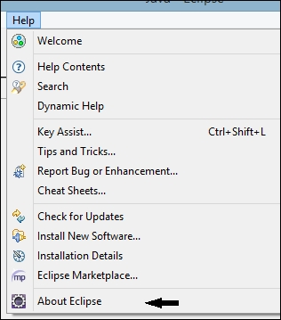
    

2.  Click on the  **m2** icon from the
    list of icons that you see:

    
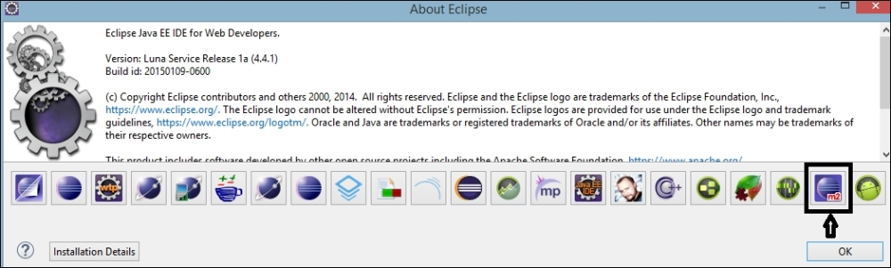
    

3.  On clicking the **m2** icon, you should see something
    similar to the following screenshot:

    
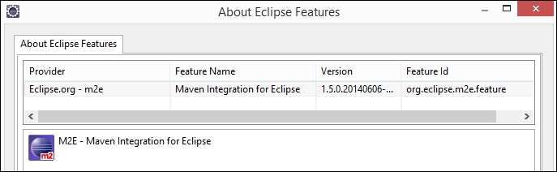
    

4.  Click on the **Maven** link by navigating to
    **Window** \| **Preferences** from the Eclipse
    menu bar.

5.  Click on  **Installations**. You will
    see the existing installations available to
    Eclipse. It uses an **EMBEDDED** installation of Maven
    that comes with Eclipse, as shown in the following screenshot:

    
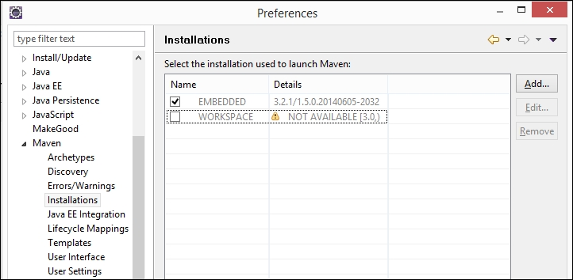
    


### Create Maven project

To create a new Maven project, perform the following steps:

1.  Navigate to **File** \| **New** \| **Other** \| **Maven Project**. You will see the following screen:

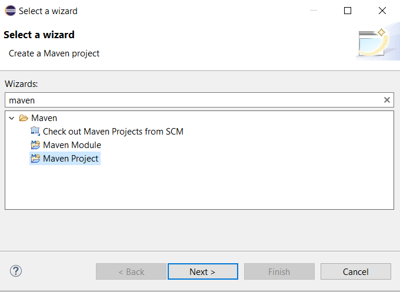

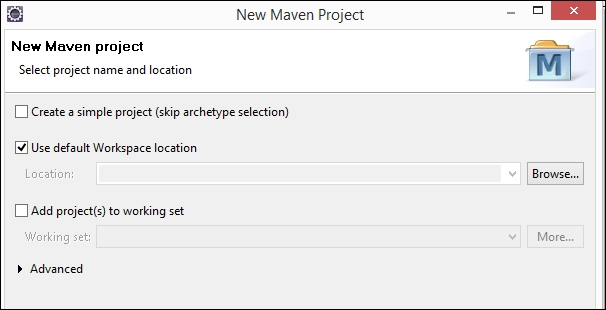
    

2.  Check the **Create a simple project (skip archetype selection)** option to avoid choosing what to create.

3.  Fill the same values that we specified as parameters in the *Lab 1*,
    (**Group Id:**
    `com.fenago.maven`, **Artifact Id:**
    `simple-project`) to create a simple Maven project.

    
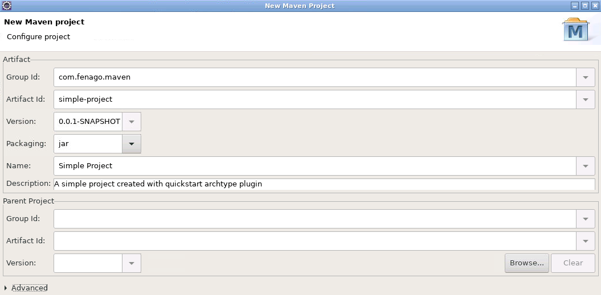
    

4.  Click on **Finish**. Your project is
    now set up. Click on the `pom.xml`
    file. You will see the following screenshot:

    
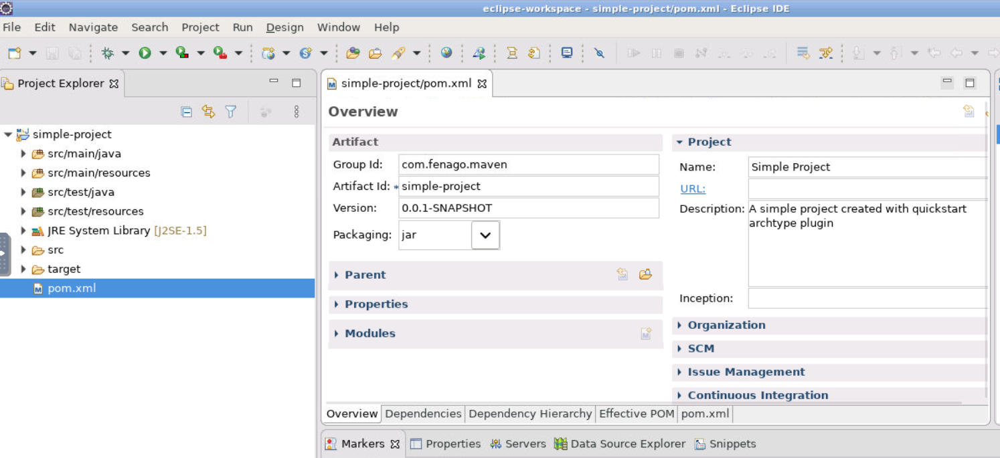

5. Create New Class as shown below:

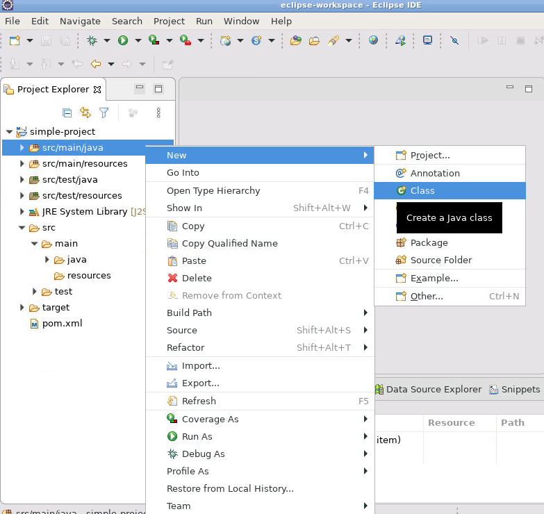

6. Use following parameters and click `Finish`:

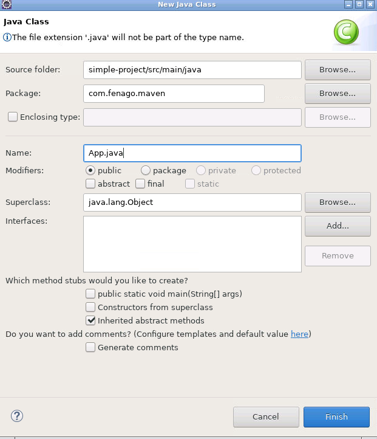

6. Copy following code in `App.java` and run the application:

```
package com.fenago.maven;

/**
 * Hello world!
 *
 */
public class App 
{
    public static void main( String[] args )
    {
        System.out.println( "Hello World!" );
    }
}

```

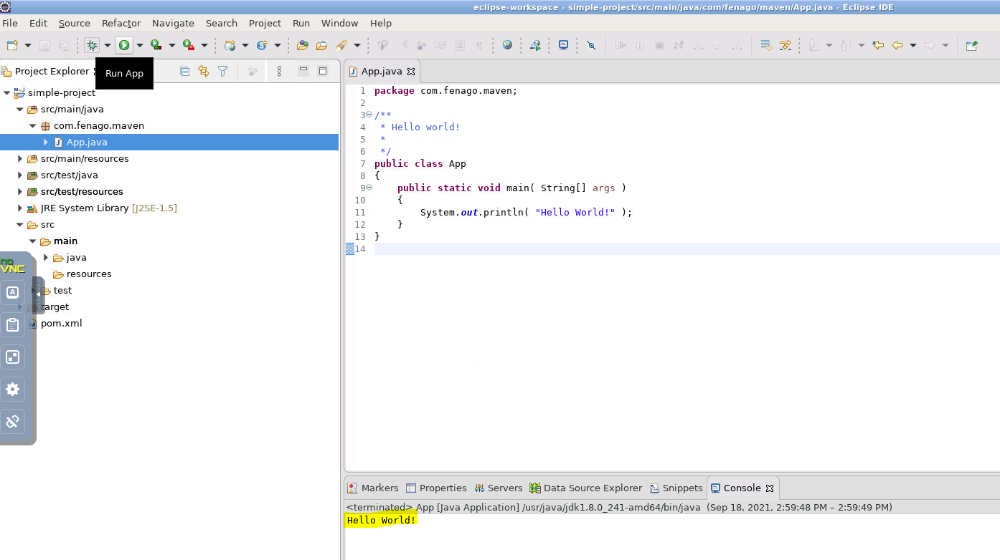


Eclipse invokes the Maven archetype plugin to
create a quick start project. The Eclipse console shows the steps
performed, and the project is created.

The folder structure and contents are identical to the project created from the command-line.


#### Importing an existing Maven project in Eclipse

If you have already set up a Maven project from the
command-line, then it can easily be imported to
Eclipse.


### How to do it\...

To import an existing Maven project in Eclipse, perform the following steps:


1.  Navigate to **File** \| **Import...** and click on **Maven**:

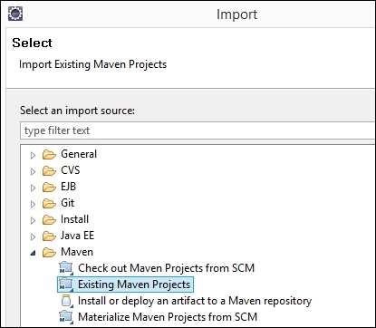
    

2.  Choose the project we created earlier:

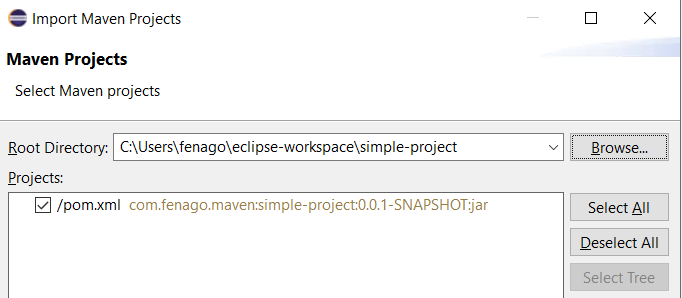

**Note:** You will need to close project first to be able to import it:

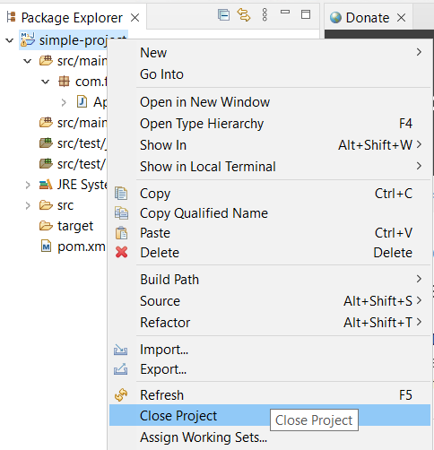

3.  Import the project. You will see contents identical to what we saw
    when creating a new Maven project.


### How it works\...

Eclipse has built-in support for Maven projects. When a Maven project is
imported, it parses the pom file, `pom.xml`, for the specified
project. Based on the project\'s pom configuration file, it creates
relevant Eclipse configurations to recognize source files, tests, and
artifacts.
