#### Introduction to Jenkins


In this lab, we will use Eclipse IDE to set up Selenium WebDriver
project, and additionally we add m2eclipse plugin to eclipse to help the
build process and to create POM.xml file.

### **Steps to add m2eclipse plugin to Eclipse:**

**Step 1:** Launch Eclipse IDE and click on Help \> Select Install New
Software

**Step 2: Enter the URL** [http://download.eclipse.org/technology/m2e/releases/](http://download.eclipse.org/technology/m2e/releases/)
on the Install dialog. Select Work with and m2e plugin as shown in the
below screenshot.

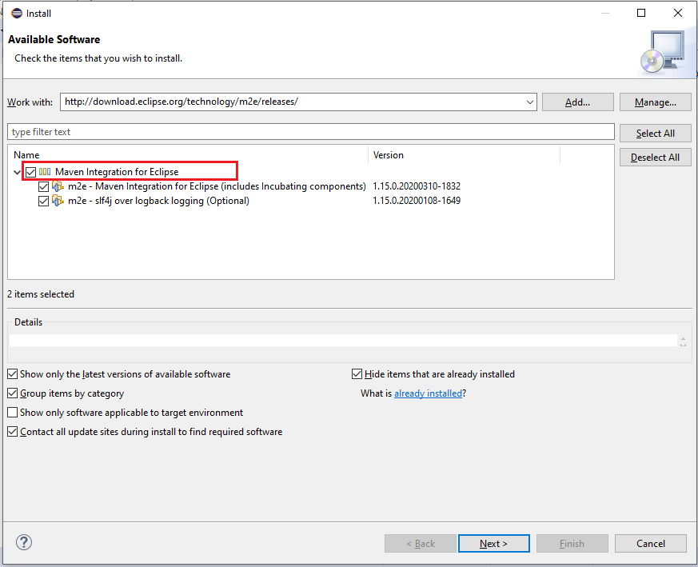

**Step 3:** Click on Next button.

**Step 4:** Accept the License agreement and click Finish button.

**Step 5:** Click On Restart Now to restart the eclipse.

### **Configure Eclipse with Maven**

We now need to create Maven project once m2e plugin is installed.

**Step 1:** Launch Eclipse IDE
and create a New Project by selecting **File** \> **New** \> **Other**
from Eclipse menu.

**Step 2:** On the **New** dialog box, Expand **Maven** and select
**Maven Project** and click Next.

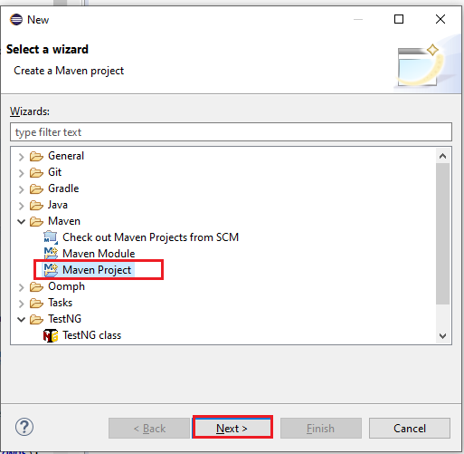

**Step 3:** On the **New Maven Project**, check the **Create a simple
project** and click on Next.

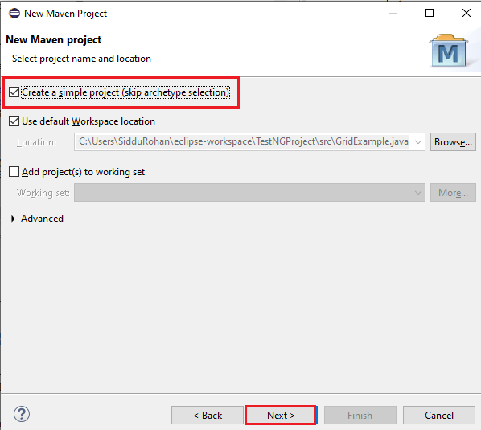

**Step 4:** Enter TestWebdriver in **Group Id**, **Artifact Id** and
click on **Finish**.

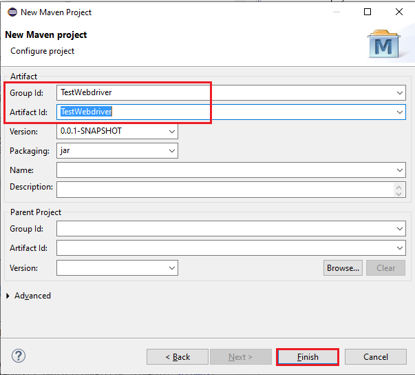

**Step 5:** Eclipse will create **TestWebdriver** with following
structure:

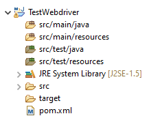

**Step 6:**  Right-click on **JRE System Library** and select the option
**Properties** from the menu.

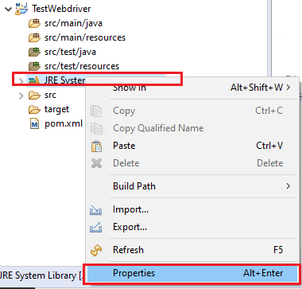

On **JRE System Library** **Properties**dialog box, make
sure **Workspace default JRE** is selected and click Apply and Close.

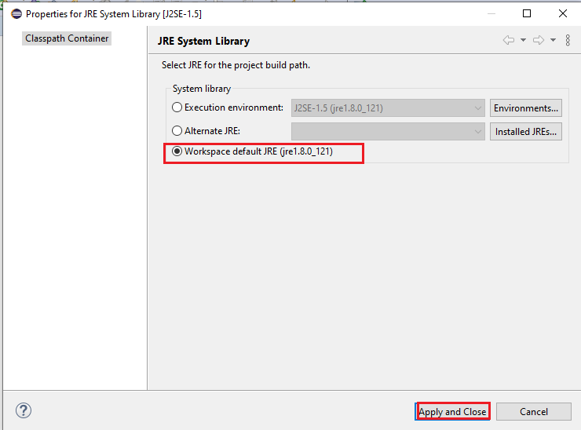

**Step 7:** Double-click on **pom.xml** from **Project Explorer**.

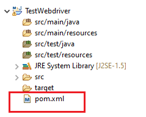

pom.xml file will Open in Editor section

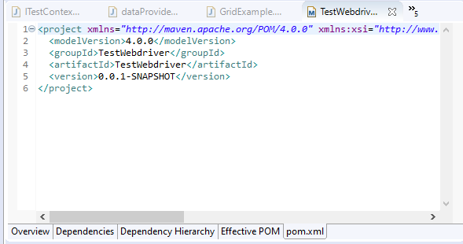

**Step 8:**  Add the Selenium, Maven, TestNG, Junit dependencies to
pom.xml in the \<project\> node:


```
<dependencies>			
        <dependency>				
             <groupId>junit</groupId>								
             <artifactId>junit</artifactId>								
             <version>3.8.1</version>								
             <scope>test</scope>								
        </dependency>				
        <dependency>				
            <groupId>org.seleniumhq.selenium</groupId>								
            <artifactId>selenium-java</artifactId>								
            <version>2.45.0</version>								
		</dependency>				
        <dependency>				
            <groupId>org.testng</groupId>								
            <artifactId>testng</artifactId>								
            <version>6.10.0</version>								
            <scope>test</scope>							  			
       </dependency>				
</dependencies>
```

**Step 9:** Create a New TestNG Class. Enter Package name as "testing"
and "NewTest" in the **Name**: textbox and click on
the **Finish** button

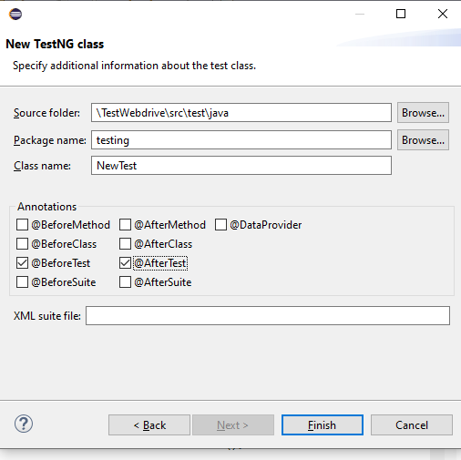

**Step 10:** Eclipse will create the NewTest class as shown in the below
screenshot:


**Step 11:** Add the below code to the **NewTest** class

```
package testing;

import org.testng.annotations.Test;
import org.testng.annotations.BeforeTest;
import org.openqa.selenium.WebDriver;
import org.openqa.selenium.firefox.FirefoxDriver;
import org.testng.Assert;
import org.testng.annotations.AfterTest;

public class NewTest {
    private WebDriver driver;
@Test
public void testEasy() {
driver.get("https://www.facebook.com/");  
String title = driver.getTitle();  
//Assert.assertTrue(title.contains("Facebook"));
Assert.assertTrue(driver.getTitle().contains("Facebook"));

}
@BeforeTest
public void beforeTest() {
    driver = new FirefoxDriver();  
}
@AfterTest
public void afterTest() {
driver.quit();
}

}
```

**Step 12:**  Right-click on the TestWebdriver and select **TestNG** and
**Convert to TestNG**. Eclipse will create testng.xml which says that
you need to run only one test with the name **NewTest** as shown in the
below screenshot:

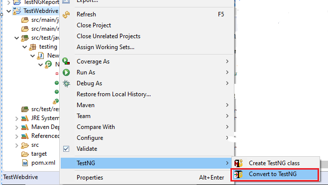

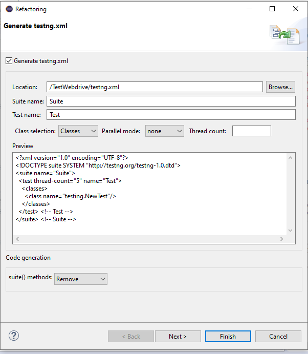

Update the project and make sure that file appears in the tree **Package
Explorer** (right click on the project and click Refresh).

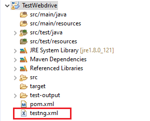

**Step 13:** Now run the above test through this **testng.xml.**

Go to the **Run Configurations under Run**and create a new
launch **TestNG**, select the project and
field **Suite** as **testng.xml** and click Run

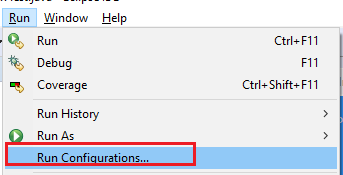

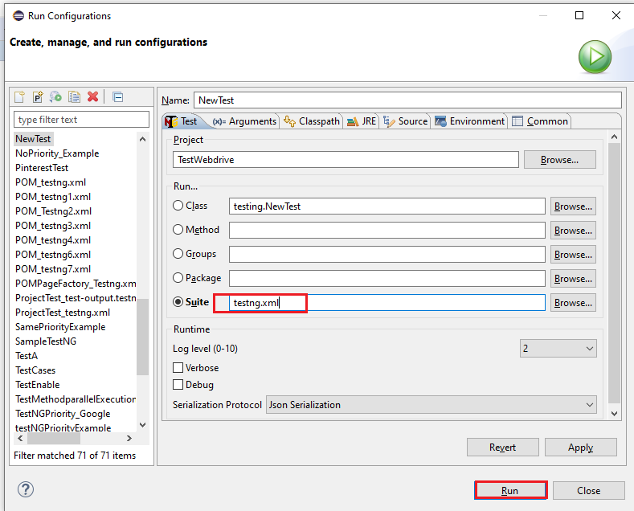

This will launch the website and finished the build successfully.

**Step 14:** Additionally, to pom.xml we need to add

1.  maven-compiler-plugin
2.  maven-surefire-plugin
3.  testng.xml

The maven-surefire-plugin is used to configure and execute the tests. To
configure the testing.xml for TestNG test and generate to test reports
this plugin is used.

The maven-compiler-plugin is used in compiling the code and using the
particular JDK version for compilation. Add all the dependencies in the
below code, to pom.xml in the \<plugin\> node:

```
<plugins>
  <plugin>
<groupId>org.apache.maven.plugins</groupId>
<artifactId>maven-compiler-plugin</artifactId>
<version>2.3.2.</version>
<configuration>
<source>1.7</source>
<target>1.7</target>
</configuration>
</plugin>
  <plugin>
<groupId>org.apache.maven.plugins</groupId>
<artifactId>maven-surefire-plugin</artifactId>
<version>2.12</version>
<inherited>true</inherited>
<configuration>
<suiteXmlFiles>
  <suiteXmlFile>testng.xml</suiteXmlFile>
</suiteXmlFiles>
</configuration>
</plugin>
</plugins>
```

**Step 15:**  To run th**e** tests in the Maven lifecycle, Right-click on
the TestWebdriver and select **Run As** **Maven test**. From the project
Maven will execute the test.

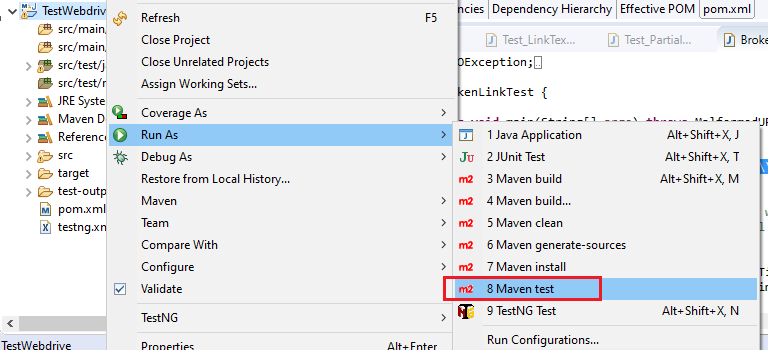

This will launch the website and finished the build successfully.

**Installation steps for Jenkins and configure it to Run Maven with TestNg**
-----------------------------------------------------------------------------

Step 1: Go to the URL [https://www.jenkins.io/](https://www.jenkins.io/)
and download the package for your OS and click Download button.

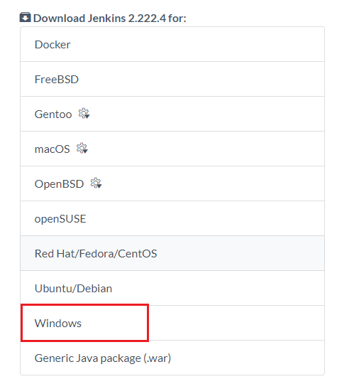

**Step 2:** Unzip the Jenkins folder and run the exe file as shown in
the below image:

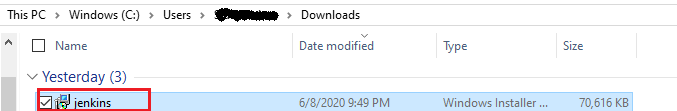

**Step 3:** In **Jenkins 2.233 Setup** window click on **Next** button.

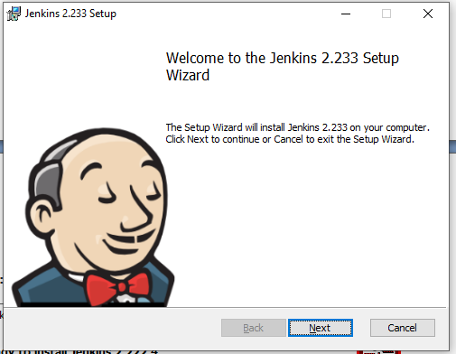

**Step 4:** Click on **Install** button.

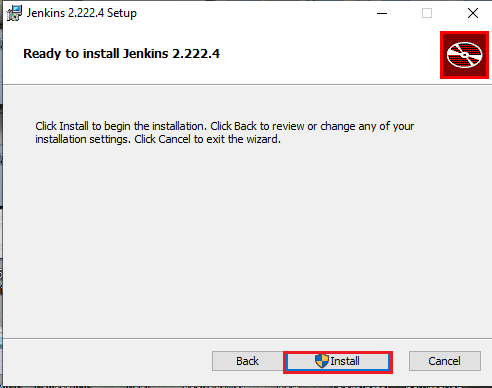

**Step 5:** Once installation is complete, it automatically navigate to
the Jenkins Dashboard (http://localhost:8080) in the browser window.

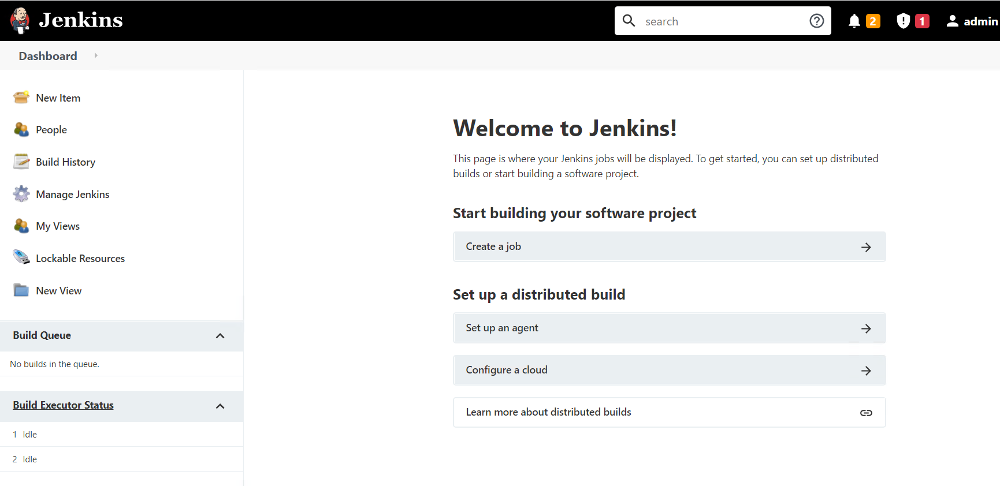

**Step 6:** Click on the **New Item**to create a job.

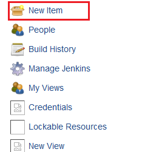

**Step 7:** Enter an Item Name and click OK button

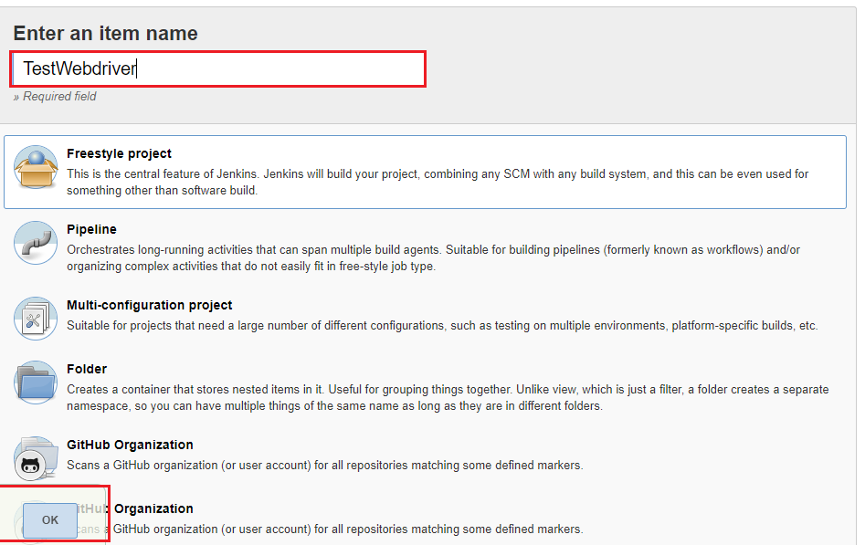

**Step 8:** A new job with name "TestWebdriver" is created in Jenkins
Dashboard.

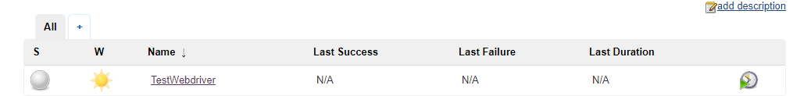

**Step 9:**  Go to **Manage Jenkins** and select **Global Tool
Configuration** as shown in the below image.

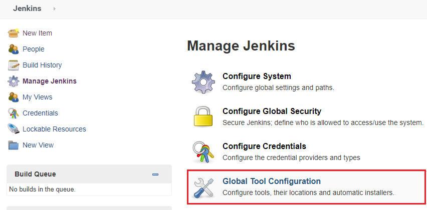

Click on JDK installations and configure JDK as in the following image:

Enter JDK Name: java 1.8.0

```
JAVA_HOME C:\Program Files\Java\jdk1.8.0_202
```

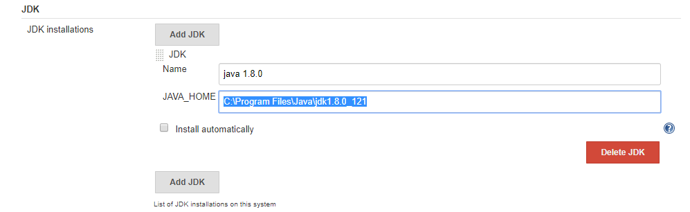

**Step 10:** Go to the **Build** section of created job.

Add the pom.xml file’s path in the **Root POM** option.

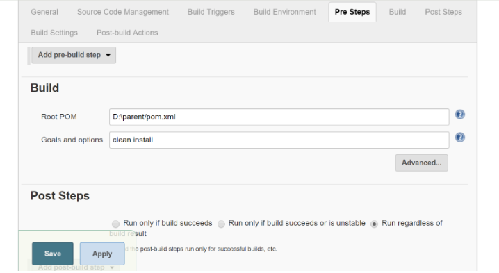

**Step 11:** Click on the **Apply** button.

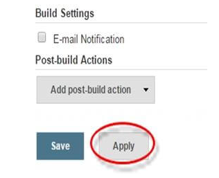

**Step 12:** On the TestWebdriver project page, click on the **Build
Now** link.

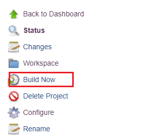

Maven will build the project. It will have TestNG execute the test
cases.

**Step 13:** Once the build process is completed, in Jenkins Dashboard
click on the** TestWebdriver** project.

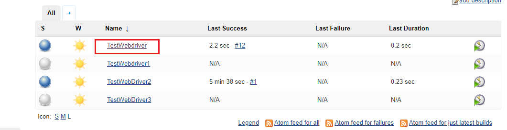

**Step 14:**  The TestWebdriver project page displays the build history
and links to the results as shown in the below image:

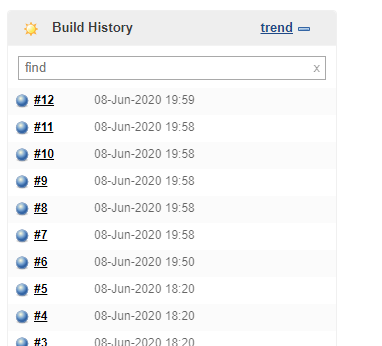

**Step 15:** To view the test results click on the "Latest Test Result" link.

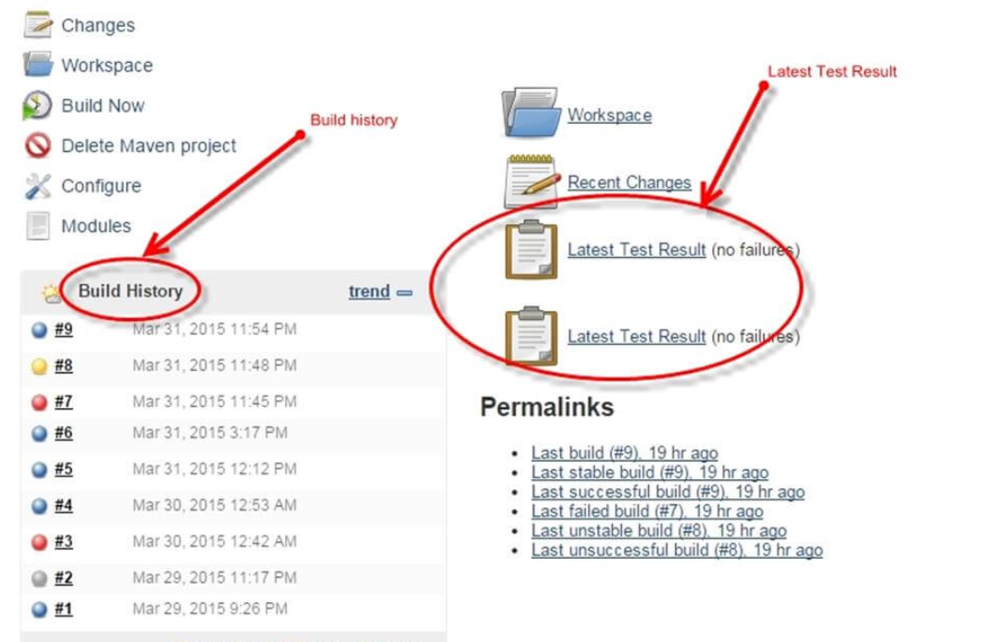

**Step 16:** Select specific build, and you will see the current status by clicking on "console output".

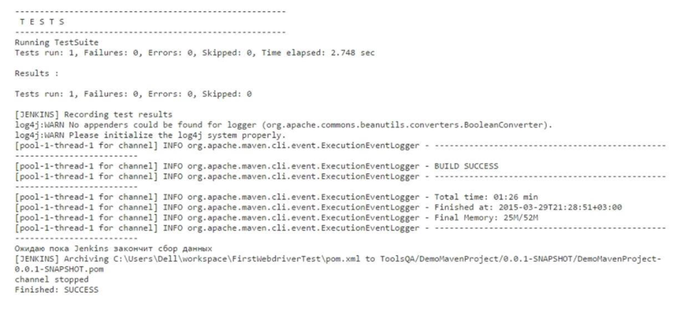

#### Scheduling Jenkins for automatic execution.

Scheduling builds(Selenium Tests) is one of the important features of Jenkins where it automatically triggers the build, based on defined criteria. Jenkins provides multiple ways to trigger the build process under the Build Trigger configuration.

For example:
Enter `0 23 * * *` in the Schedule textbox as shown in the following screenshot. This will trigger the build process every day at 11 p.m.

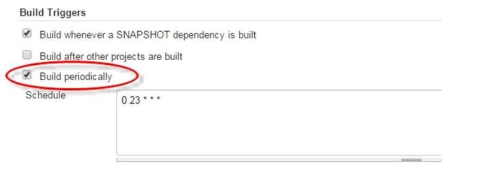
