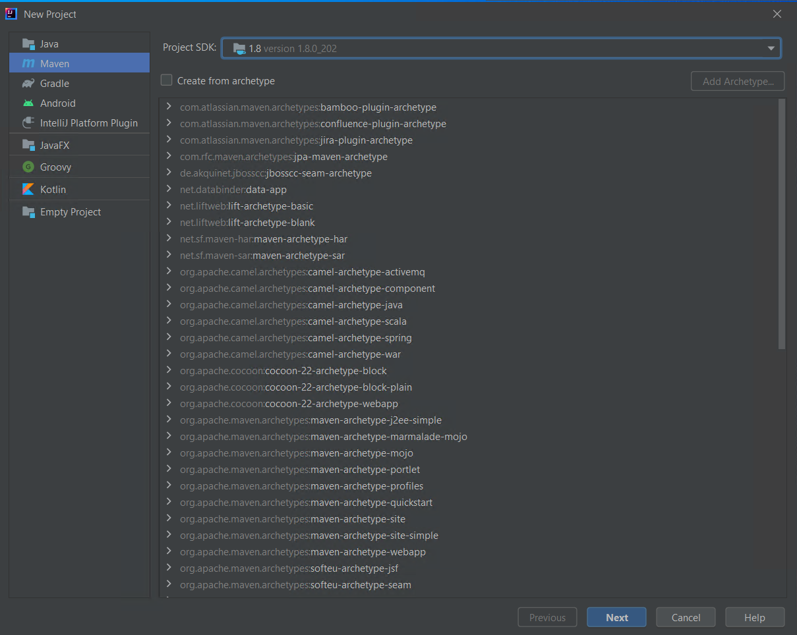

#### Introduction to Jenkins


In this lab, we will use Eclipse IDE to set up Selenium WebDriver
project, and additionally we add m2eclipse plugin to eclipse to help the
build process and to create POM.xml file.

#### Configure Eclipse with Maven

We now need to create Maven project.

**Step 1:** In IntelliJ, select `File` | `New` | `New Project`

**Step 2:** Select Maven on left side of window then click on Next button



**Step 3:** Enter **TestWebdriver** in the Name field

**Step 4:** Click on the arrow next to Artifact Coordinates

**Step 5:** Change the Group Id and Artifact Id to TestWebdriver as well

**Step 6:**  Click Finish

**Step 7:** When asked if you want to open this project in a new window or this window, select `This Window`

**Step 8:**  Add the Selenium, Maven, TestNG, Junit dependencies to pom.xml in the \<project\> node by replacing `pom.xml` content with following:


```
<?xml version="1.0" encoding="UTF-8"?>
<project xmlns="http://maven.apache.org/POM/4.0.0"
         xmlns:xsi="http://www.w3.org/2001/XMLSchema-instance"
         xsi:schemaLocation="http://maven.apache.org/POM/4.0.0 http://maven.apache.org/xsd/maven-4.0.0.xsd">
    <modelVersion>4.0.0</modelVersion>

    <groupId>TestWebdriver</groupId>
    <artifactId>TestWebdriver</artifactId>
    <version>1.0-SNAPSHOT</version>

    <properties>
        <maven.compiler.source>8</maven.compiler.source>
        <maven.compiler.target>8</maven.compiler.target>
    </properties>

    <dependencies>
        <dependency>
            <groupId>junit</groupId>
            <artifactId>junit</artifactId>
            <version>4.13.2</version>
            <scope>test</scope>
        </dependency>
        <dependency>
            <groupId>org.seleniumhq.selenium</groupId>
            <artifactId>selenium-java</artifactId>
            <version>3.141.5</version>
        </dependency>
        <dependency>
            <groupId>org.testng</groupId>
            <artifactId>testng</artifactId>
            <version>6.10</version>
            <scope>test</scope>
        </dependency>
        <dependency>
            <groupId>org.seleniumhq.selenium</groupId>
            <artifactId>htmlunit-driver</artifactId>
            <version>2.33.3</version>
        </dependency>
    </dependencies>

</project>
```

**Step 9:** Right-click on pom.xml and select **Maven | Reload project**

**Step 10:** Create a new class under src/main/java:

        - Put it in package testing
        - Give the class the name NewFile

**Step 11:** Open the new file, and right-click on the class name. Select Generate... and then select Test...

**Step 12:** In Create Test pop-up window, change the Testing library to TestNG

**Step 13:** Define the class name to be NewTest and select to generate setUp and tearDown

**Step 14:** Click `OK`

**Step 15:** Add the below code to the **NewTest** class

```
package testing;

import org.openqa.selenium.htmlunit.HtmlUnitDriver;
import org.testng.annotations.AfterMethod;
import org.testng.annotations.BeforeMethod;
import org.openqa.selenium.WebDriver;
import org.openqa.selenium.firefox.FirefoxDriver;
import org.testng.annotations.Test;

import static org.testng.Assert.*;

public class NewTest {

    private WebDriver driver;

    @Test
    public void testEasy() {
        driver.get("https://www.facebook.com/");
        String title = driver.getTitle();
        assertTrue(title.contains("Facebook"));
    }
    @BeforeMethod
    public void setUp() {
        // Uncomment following lines to use firefox instead of HtmlUnitDriver
        // System.setProperty("webdriver.gecko.driver", "C:\\Selenium\\drivers\\firefox\\geckodriver.exe");
        // driver = new FirefoxDriver();
        
        driver = new HtmlUnitDriver();
    }

    @AfterMethod
    public void tearDown() {
        driver.quit();
    }
}
```

**Step 16:**  Write `testng.xml` file.

```
<?xml version="1.0" encoding="UTF-8" ?>
<!DOCTYPE suite SYSTEM "http://testng.org/testng-1.0.dtd">
<suite name = "Suite">
    <test thread-count="5" name= "Test">
        <classes>
            <class name="testing.NewTest"></class>
        </classes>
    </test>
</suite>
```

**Step 17:** Right-click on project name and go to Modify Run Configuration... | All Tests (the second one)

This will launch the website and finished the build successfully.

**Step 18:** Additionally, to pom.xml we need to add

1.  maven-compiler-plugin
2.  maven-surefire-plugin
3.  testng.xml

The maven-surefire-plugin is used to configure and execute the tests. To
configure the testing.xml for TestNG test and generate to test reports
this plugin is used.

The maven-compiler-plugin is used in compiling the code and using the
particular JDK version for compilation. Add all the dependencies to the pom.xml in the \<plugin\> node. Replace  complete `pom.xml` with following: 

```
<?xml version="1.0" encoding="UTF-8"?>
<project xmlns="http://maven.apache.org/POM/4.0.0"
         xmlns:xsi="http://www.w3.org/2001/XMLSchema-instance"
         xsi:schemaLocation="http://maven.apache.org/POM/4.0.0 http://maven.apache.org/xsd/maven-4.0.0.xsd">
    <modelVersion>4.0.0</modelVersion>

    <groupId>TestWebdriver</groupId>
    <artifactId>TestWebdriver</artifactId>
    <version>1.0-SNAPSHOT</version>

    <properties>
        <maven.compiler.source>8</maven.compiler.source>
        <maven.compiler.target>8</maven.compiler.target>
    </properties>

    <dependencies>
        <dependency>
            <groupId>junit</groupId>
            <artifactId>junit</artifactId>
            <version>4.13.2</version>
            <scope>test</scope>
        </dependency>
        <dependency>
            <groupId>org.seleniumhq.selenium</groupId>
            <artifactId>selenium-java</artifactId>
            <version>3.141.5</version>
        </dependency>
        <dependency>
            <groupId>org.testng</groupId>
            <artifactId>testng</artifactId>
            <version>6.10</version>
            <scope>test</scope>
        </dependency>
        <dependency>
            <groupId>org.seleniumhq.selenium</groupId>
            <artifactId>htmlunit-driver</artifactId>
            <version>2.33.3</version>
        </dependency>
    </dependencies>

    <build>
        <plugins>
            <plugin>
                <groupId>org.apache.maven.plugins</groupId>
                <artifactId>maven-compiler-plugin</artifactId>
                <version>3.7.0</version>
                <!-- <configuration>
                    <source>1.8</source>
                    <target>1.8</target>
                </configuration> -->
            </plugin>
            <plugin>
                <groupId>org.apache.maven.plugins</groupId>
                <artifactId>maven-surefire-plugin</artifactId>
                <version>3.0.0-M1</version>
                <inherited>true</inherited>
                <configuration>
                    <suiteXmlFiles>
                        <suiteXmlFile>testng.xml</suiteXmlFile>
                    </suiteXmlFiles>
                </configuration>
            </plugin>
        </plugins>
    </build>
</project>
```

**Step 19:** Update Maven, then run the tests
                - Go to Maven tag and select


This will launch the website and finished the build successfully.

**Installation steps for Jenkins and configure it to Run Maven with TestNg**
-----------------------------------------------------------------------------

**Step 1:** Go to the URL [https://www.jenkins.io/](https://www.jenkins.io/)
and download the package for your OS and click Download button.


**Step 2:** Unzip the Jenkins folder and run the exe file as shown in
the below image:


**Step 3:** In **Jenkins 2.233 Setup** window click on **Next** button.


**Step 4:** Click on **Install** button.


**Step 5:** Once installation is complete, it automatically navigate to
the Jenkins Dashboard (http://localhost:8080) in the browser window.


**Step 6:** Click on the **New Item**to create a job.


**Step 7:** Enter an Item Name and click OK button


**Step 8:** A new job with name "TestWebdriver" is created in Jenkins
Dashboard.


**Step 9:**  Go to **Manage Jenkins** and select **Global Tool Configuration** as shown in the below image.


Click on JDK installations and configure JDK as in the following image:

Enter JDK Name: java 1.8.0

```
JAVA_HOME C:\Program Files\Java\jdk1.8.0_202
```


**Step 10:** Go to the **Build** section of created job.

Add the pom.xml file’s path in the **Root POM** option.


**Step 11:** Click on the **Apply** button.


**Step 12:** On the TestWebdriver project page, click on the **Build
Now** link.


Maven will build the project. It will have TestNG execute the test
cases.

**Step 13:** Once the build process is completed, in Jenkins Dashboard
click on the **TestWebdriver** project.


**Step 14:**  The TestWebdriver project page displays the build history
and links to the results as shown in the below image:


**Step 15:** To view the test results click on the "Latest Test Result" link.


**Step 16:** Select specific build, and you will see the current status by clicking on "console output".


#### Scheduling Jenkins for automatic execution.

Scheduling builds(Selenium Tests) is one of the important features of Jenkins where it automatically triggers the build, based on defined criteria. Jenkins provides multiple ways to trigger the build process under the Build Trigger configuration.

For example:
Enter `0 23 * * *` in the Schedule textbox as shown in the following screenshot. This will trigger the build process every day at 11 p.m.


