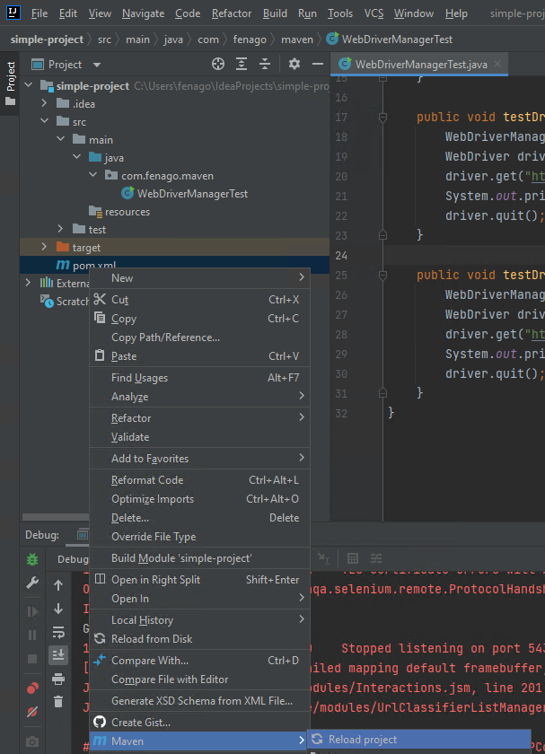
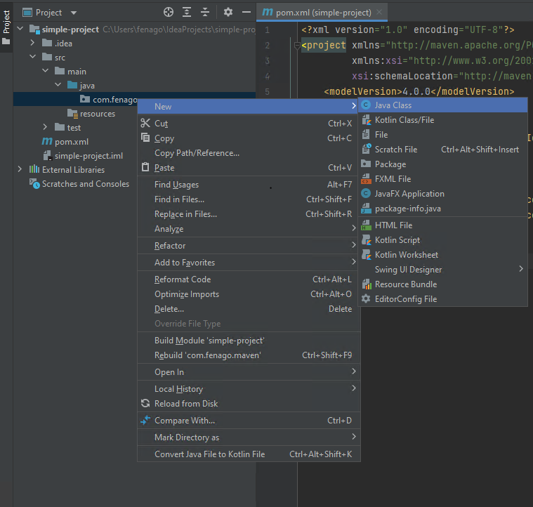
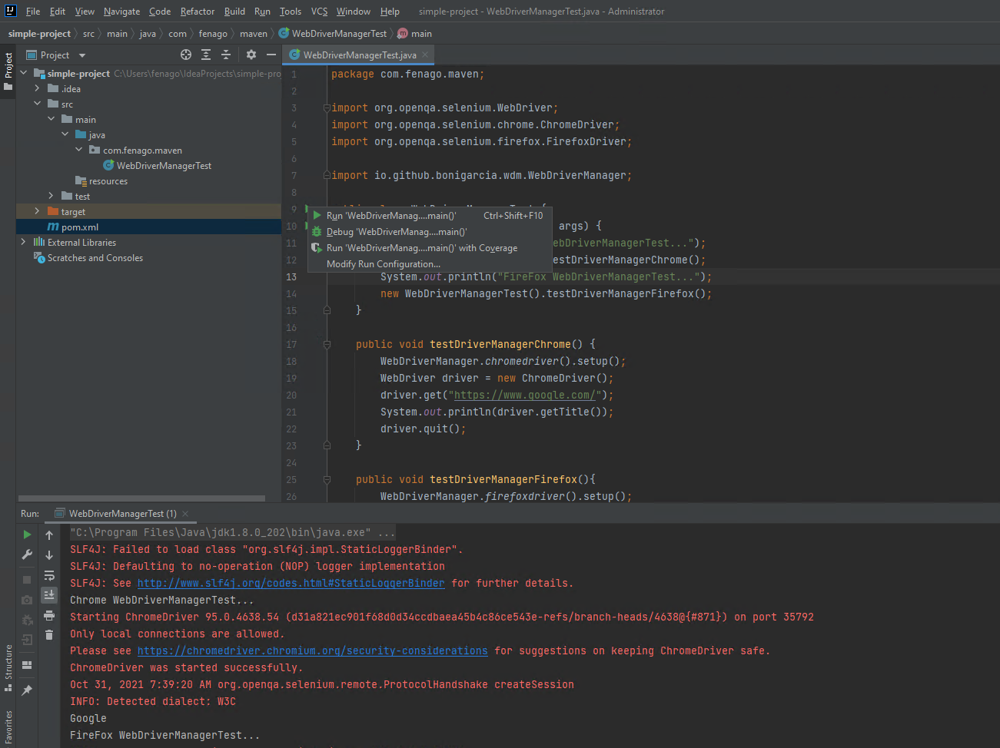
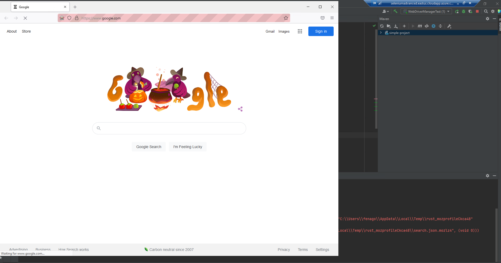

Lab 4: Using WebDriver-Manager
===============================


In this lab, we are going to leverage WebDriverManager by Boni
Garcia to setup browser drivers required to execute our tests.

**Problem Statement**

We all know that we need to have browser drivers, .exe files like
chromedriver.exe and geckodriver.exe in case of windows environment or
binary files like chromedriver and geckodriver in case of linux
distributions, in order to run our selenium webdriver automation scripts
on chrome and firefox browsers.

And also we need to set the path of these files in our script like below
or we need to add location to the class path.

**Example for chrome browser**

```
System.setProperty("webdriver.chrome.driver", "/path/to/binary/chromedriver");
```


**Example for firefox browser:**

```
System.setProperty("webdriver.gecko.driver", "/path/to/binary/geckodriver");
```


If the path is not defined or if the path provided is wrong, we will get
an exception like below when running our tests.

```
Exception in thread "main" java.lang.IllegalStateException: The path to the driver executable must be set by the webdriver.gecko.driver system property; for more information, see https://github.com/mozilla/geckodriver. The latest version can be downloaded from https://github.com/mozilla/geckodriver/releases
    at com.google.common.base.Preconditions.checkState(Preconditions.java:847)
    at org.openqa.selenium.remote.service.DriverService.findExecutable(DriverService.java:125)
    at org.openqa.selenium.firefox.GeckoDriverService.access$100(GeckoDriverService.java:43)
    at org.openqa.selenium.firefox.GeckoDriverService$Builder.findDefaultExecutable(GeckoDriverService.java:168)
    at org.openqa.selenium.remote.service.DriverService$Builder.build(DriverService.java:346)
    at org.openqa.selenium.firefox.FirefoxDriver.toExecutor(FirefoxDriver.java:168)
    at org.openqa.selenium.firefox.FirefoxDriver.(FirefoxDriver.java:125)
    at org.openqa.selenium.firefox.FirefoxDriver.(FirefoxDriver.java:103)
```

To avoid this error, we need to manually download and manage these
drivers for each operating systems/environments and that is very
painful. We also have to check and update relevant drivers when new
versions of the binaries are released or new browsers versions are
released along with compatibility for driver to browser.

WebDriverManager by Boni Garcia helps us to manage driver related
settings automatically. Webdriver manager downloads binaries/executables
in an automated way and helps us to avoid all the manual steps that we
do previously related to browser drivers to run our tests.

It supports browsers such as Chrome, Firefox, Opera, PhantomJS,
Microsoft Edge, or Internet Explorer. You can check that in [project page](https://github.com/bonigarcia/webdrivermanager).


Check [maven page](https://mvnrepository.com/artifact/io.github.bonigarcia/webdrivermanager/) for more details of supported builder projects.

**Solution**

Lab solution is present in following directory:

`C:\Users\fenago\Desktop\advanced-selenium-java\Lab04\simple-project`

**Maven Project**

We will use `simple-project` maven project created in Lab 2.

In case of **Maven project**, we need to add the following dependency in pom.xml:

```
    <dependencies>
        <dependency>
            <groupId>org.seleniumhq.selenium</groupId>
            <artifactId>selenium-java</artifactId>
            <version>3.141.5</version>
        </dependency>
        <dependency>
            <groupId>io.github.bonigarcia</groupId>
            <artifactId>webdrivermanager</artifactId>
            <version>4.4.3</version>
        </dependency>
    </dependencies>
```

Right-click on pom.xml and select **Maven | Reload project**



**Launch chrome and firefox browser**


- Define new class called `WebDriverManagerTest` and copy following code:




```
package com.fenago.maven;

import org.openqa.selenium.WebDriver;
import org.openqa.selenium.chrome.ChromeDriver;
import org.openqa.selenium.firefox.FirefoxDriver;

import io.github.bonigarcia.wdm.WebDriverManager;

public class WebDriverManagerTest {
    public static void main(String[] args) {
        System.out.println("Chrome WebDriverManagerTest...");
        new WebDriverManagerTest().testDriverManagerChrome();
        System.out.println("FireFox WebDriverManagerTest...");
        new WebDriverManagerTest().testDriverManagerFirefox();
    }

    public void testDriverManagerChrome() {
        WebDriverManager.chromedriver().setup();
        WebDriver driver = new ChromeDriver();
        driver.get("https://www.google.com/");
        System.out.println(driver.getTitle());
        driver.quit();
    }

    public void testDriverManagerFirefox(){
        WebDriverManager.firefoxdriver().setup();
        WebDriver driver = new FirefoxDriver();
        driver.get("https://www.google.com/");
        System.out.println(driver.getTitle());
        driver.quit();
    }
}
```

**Run WebDriver Application**






**Note:**

To download specific versions or from specific urls, change respective
value of the variables in version.properties or
webdrivermanager.properties depending on where it is available.\
Also you can add support to any new versions of browser driver by
defining it in version.properties.

Have a look at [version.properties](https://github.com/bonigarcia/webdrivermanager/blob/master/src/main/resources/versions.properties)


Have a look at [webdrivermanager.properties](https://github.com/bonigarcia/webdrivermanager/blob/master/src/main/resources/webdrivermanager.properties)

At any time you want to change default values, copy the required files
from [here](https://github.com/bonigarcia/webdrivermanager/tree/master/src/main/resources)
into your resources directory with exact same name and update required values in the property file. That’s it.
