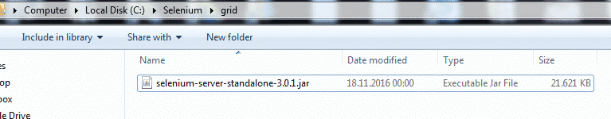

Lab 5: Working with Selenium Grid
==================================

In this lab, We will describe how to use Selenium Grid. You will learn
how to install a selenium grid and how to configure it.


#### Lab Solution
Lab solution is present in `C:\Users\fenago\Desktop\advanced-selenium-java\Lab05` folder. 


Go to [http://www.seleniumhq.org/download/](http://www.seleniumhq.org/download/)
and download **Selenium Standalone Server.** Selenium team constantly
updating the versions. You may see a different version, pls do not
panic, just download it. ;)


Then, **copy the .jar** file to **C:\\Selenium\\grid\\** folder.




**What are Hub and Nodes?**
---------------------------

Basically, we have a **Hub** which is a server that we connect from our
tests and we have **Nodes,**they can be on different machines and they
register with the hub.***Simply, we have a hub and several nodes, nodes
are registered in our hub and the hub knows which browsers are
available. Hub sends requests to the nodes based on desired capabilities
and executes the tests.***

### **How to Start and Configure Hub and Nodes**

The best way to start hub and node with .bat files for Windows also it
is easier and tidier to configure them with **.json files**.

First, let’s start the hub by command window.

**Hub Start Command:**

java -jar selenium-server-standalone-3.0.1.jar -role hub

`java -jar selenium-server-standalone-3.0.1.jar -role hub`


and you can see the hub panel on your browser as follows.


### **Let’s start the node**

We can start the node with the command window as below command.

**Node Start Command:**

java -jar selenium-server-standalone-3.0.1.jar -role node -hub
http://localhost:4444/grid/register

`java -jar selenium-server-standalone-3.0.1.jar -role node -hub http://localhost:4444/grid/register`


and when you open the grid console you can see that the node registered
with the hub.

[](./images/img_5830af2b6be00.png)


When we wanted to use a selenium grid in our tests we need to tell our
grid where the required browser executable is located. Thus, we should
start to the node as below command before writing our tests. **We added the blue part.**

**Node Start Command with Chrome Driver Location:**

```
java -jar -Dwebdriver.chrome.driver=C:\Selenium\drivers\chrome\chromedriver.exe selenium-server-standalone-3.0.1.jar -role node -hub http://localhost:4444/grid/register 
```


**Lab Solution:**

Lab solution is present in following directory:

`C:\Users\fenago\Desktop\advanced-selenium-java\Lab05`

Let's write a very simple test that enter inputs in the Facebook login page. Before
running the below test, start the hub and the node with the above
command then run the test.


```
package grid;

import org.junit.AfterClass;
import org.junit.BeforeClass;
import org.junit.Test;
import org.openqa.selenium.By;
import org.openqa.selenium.Platform;
import org.openqa.selenium.WebDriver;
import org.openqa.selenium.WebElement;
import org.openqa.selenium.remote.DesiredCapabilities;
import org.openqa.selenium.remote.RemoteWebDriver;

import java.net.MalformedURLException;
import java.net.URL;

/**
 * Created by fenago
 */
public class GridExampleTest {

    static WebDriver driver;

    //Setup Driver
    @BeforeClass
    public static void setupTest() throws MalformedURLException {
        /*String chromeDriverLocation = "C:\\Selenium\\drivers\\chrome\\chromedriver.exe";
        System.out.println("Chrome Driver: " + chromeDriverLocation );
        System.setProperty("webdriver.chrome.driver", chromeDriverLocation);
        driver = new ChromeDriver();*/
        /*DesiredCapabilities caps = DesiredCapabilities.chrome();
        caps.setPlatform(Platform.WINDOWS);

        driver = new RemoteWebDriver(new URL("http://localhost:4444/wd/hub"), caps);*/

        DesiredCapabilities caps = DesiredCapabilities.chrome();
        caps.setPlatform(Platform.WINDOWS);

        driver = new RemoteWebDriver(new URL("http://localhost:4444/wd/hub"), caps);
    }

    @Test
    public void T01_FacebookLogin() {
        //Navigate to facebook.com
        driver.navigate().to("https://web.facebook.com/");
        driver.manage().window().maximize();

        //Enter input
        WebElement emailId = driver.findElement(By.id("email"));
        emailId.sendKeys("selenium");
        WebElement password = driver.findElement(By.id("pass"));
        emailId.sendKeys("selenium");
    }

    //Close Driver
    @AfterClass
    public static void quitDriver() {
        driver.quit();
    }
}

```

**Selenium Grid Nodes and Hub Configurations by JSON**
------------------------------------------------------

It is also described at[https://github.com/SeleniumHQ/selenium/wiki/Grid2](https://github.com/SeleniumHQ/selenium/wiki/Grid2)
page as shown below.


**Hub Config:** https://github.com/SeleniumGridRefactor/grid/blob/master/src/main/resources/org/openqa/grid/common/defaults/DefaultHub.json

**Node Config:** https://github.com/SeleniumGridRefactor/grid/blob/master/src/main/resources/org/openqa/grid/common/defaults/DefaultNodeWebDriver.json


We will use the same config which is located at the above link. By using
these configurations, let's create "**starthub.bat**" and "**startnode.bat**" files.


### **starthub.bat**

```
REM start a hub with the defaults on port 4444
REM visit http://localhost:4444/grid/console to see status
REM java -jar selenium-server-standalone-3.0.1.jar -role hub

REM Start a hub with params configured in JSON file
REM https://github.com/SeleniumGridRefactor/grid/blob/master/src/main/resources/org/openqa/grid/common/defaults/DefaultHub.json
java -jar selenium-server-standalone-3.0.1.jar -role hub -hubConfig hub.json
```

### **startnode.bat**

```
REM start a node configured by the node.json
REM 
```

https://github.com/SeleniumHQ/selenium/blob/master/java/server/src/org/openqa/grid/common/defaults/DefaultNodeWebDriver.json


```
java -jar -Dwebdriver.gecko.driver=C:\Selenium\drivers\firefox\geckodriver.exe -Dwebdriver.chrome.driver=C:\Selenium\drivers\chrome\chromedriver.exe selenium-server-standalone-3.0.1.jar -role node -nodeConfig node.json 
```

**Start the HUB**


**Start the Node**


**Run the test again!** When you run the test you will see that it will pass.


