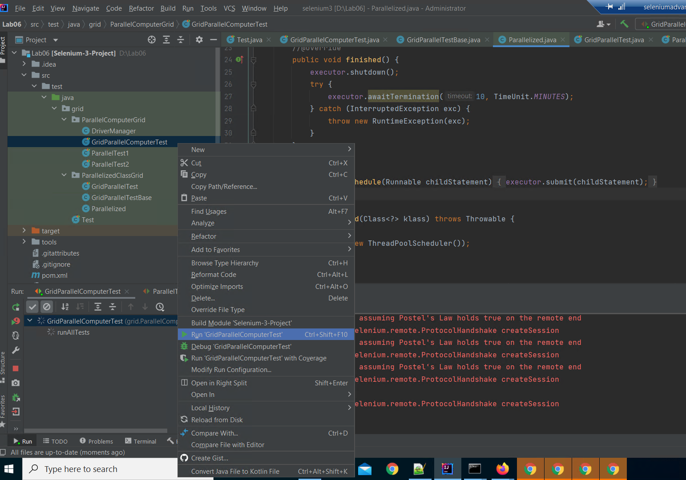
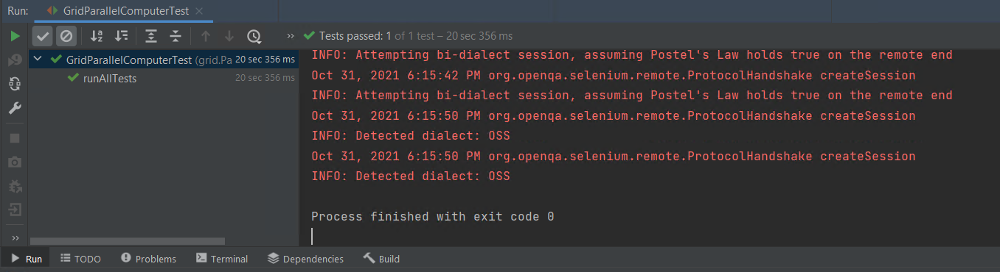

Lab 6: Parallelizing the Tests for Selenium Grid
================================================

In this lab, we will use two techniques and describe **how to run your selenium parallel tests** by using Selenium Grid (SG) and JUnit.

#### Lab Solution
Lab solution is present in `C:\Users\fenago\Desktop\advanced-selenium-java\Lab06` folder. 

**Selenium Grid Setup for Parallel Test Execution**
--------------------------------------------------

**Note:** Below config files are present in `C:\Users\fenago\Desktop\advanced-selenium-java\Lab06\config` folder. 

Our setup will be like that; we will have two nodes and one hub. Each
node has got 5 Chrome, 5 Firefox and 1 Internet Explorer browser
instances. The first node will use port 5555 and the second one will use
5556. Thus, we will create two node JSON files. These are **node1.json**
and **node2.json.** The only difference between these JSON files is port
number.

```
{
  "capabilities":
  [
    {
      "browserName": "firefox",
      "maxInstances": 5,
      "seleniumProtocol": "WebDriver"
    },
    {
      "browserName": "chrome",
      "maxInstances": 5,
      "seleniumProtocol": "WebDriver"
    },
    {
      "browserName": "internet explorer",
      "maxInstances": 1,
      "seleniumProtocol": "WebDriver"
    }
  ],
  "proxy": "org.openqa.grid.selenium.proxy.DefaultRemoteProxy",
  "maxSession": 5,
  "port": 5555,
  "register": true,
  "registerCycle": 5000,
  "hub": "http://localhost:4444",
  "nodeStatusCheckTimeout": 5000,
  "nodePolling": 5000,
  "role": "node",
  "unregisterIfStillDownAfter": 60000,
  "downPollingLimit": 2,
  "debug": false,
  "servlets" : [],
  "withoutServlets": [],
  "custom": {}
}
```

```
{
  "capabilities":
  [
    {
      "browserName": "firefox",
      "maxInstances": 5,
      "seleniumProtocol": "WebDriver"
    },
    {
      "browserName": "chrome",
      "maxInstances": 5,
      "seleniumProtocol": "WebDriver"
    },
    {
      "browserName": "internet explorer",
      "maxInstances": 1,
      "seleniumProtocol": "WebDriver"
    }
  ],
  "proxy": "org.openqa.grid.selenium.proxy.DefaultRemoteProxy",
  "maxSession": 5,
  "port": 5556,
  "register": true,
  "registerCycle": 5000,
  "hub": "http://localhost:4444",
  "nodeStatusCheckTimeout": 5000,
  "nodePolling": 5000,
  "role": "node",
  "unregisterIfStillDownAfter": 60000,
  "downPollingLimit": 2,
  "debug": false,
  "servlets" : [],
  "withoutServlets": [],
  "custom": {}
}
```

We created two node JSON files. Our `hub.json` file remains same as shown
below.


```
{
  "port": 4444,
  "newSessionWaitTimeout": -1,
  "servlets" : [],
  "withoutServlets": [],
  "custom": {},
  "capabilityMatcher": "org.openqa.grid.internal.utils.DefaultCapabilityMatcher",
  "throwOnCapabilityNotPresent": true,
  "cleanUpCycle": 5000,
  "role": "hub",
  "debug": false,
  "browserTimeout": 0,
  "timeout": 1800
}
```

In order to start Selenium Grid (hub and nodes), we should write .bat
files. These are; **startnode1.bat**, **startnode2.bat**,
**starthub.bat** and to trigger all of these .bat files with a single
.bat file I will create a **rungrid.bat** file. All these .bat files are
shown below.

```
java -jar selenium-server-standalone-3.0.1.jar -role hub -hubConfig hub.json
```


```
java -jar -Dwebdriver.gecko.driver=C:\Selenium\drivers\firefox\geckodriver.exe -Dwebdriver.chrome.driver=C:\Selenium\drivers\chrome\chromedriver.exe selenium-server-standalone-3.0.1.jar -role node -nodeConfig node1.json
```


```
java -jar -Dwebdriver.gecko.driver=C:\Selenium\drivers\firefox\geckodriver.exe -Dwebdriver.chrome.driver=C:\Selenium\drivers\chrome\chromedriver.exe selenium-server-standalone-3.0.1.jar -role node -nodeConfig node2.json
```


```
start starthub.bat
start startnode1.bat
start startnode2.bat
```

After these settings our **C:\\Selenium\\Grid** folder will look like below.


When we run "**rungrid.bat**" file it starts hub and two nodes
consecutively. After that, when you go to
**http://localhost:4444/grid/console** you will see that two nodes
registered to one hub as shown below.

[](./images/img_583a1774dfb64.png)


Now, we are ready to code parallel test execution with our grid setup. I will show you two techniques to run your selenium tests with JUnit.

**JUnit Parallel Test Execution**
--------------------------------------------

### Run Selenium Tests in Parallel using JUnit’s Parallel Computer Class**

Solution files are present in following folder:
`C:\Users\fenago\Desktop\advanced-selenium-java\Lab06\src\test\java\grid\ParallelComputerGrid`


```
    @Test
    public void runAllTests() {
        Class<?>[] classes = {ParallelTest1.class,ParallelTest2.class};

        // ParallelComputer(true,true) will run all classes and methods
        // in parallel.  (First arg for classes, second arg for methods)
        // I set true, true this means classes and methods runs in parallel.
        JUnitCore.runClasses(new ParallelComputer(true, true), classes);
    }
```

In above method first parameter of ParallelComputer() is for classes
and the second one is for methods. Here, I will run classes and methods
in parallel. Because I set both parameters as true.

Now, Let’s prepare a test scenario and then write its code.

### **Test Scenario:**

-   In first test Class;
    -   Open Facebook with Chrome in first test method
    -   Open Amazon with Firefox in second test method
-   In second test Class;
    -   Open Yahoo with Chrome.

We have two test classes. In first test class, we have two test methods
and in the second one, we have one test method.

### **Test Code:**

I used 4 classes for this test. First one is **DriverManager**, it sets
which browser driver will be used for the test.
**GridParallelComputerTest** class modifies**ParallelComputer** class and
runs the tests in parallel, the other two classes are test classes,
**ParallelTest1** and **ParallelTest2**.


```
import org.openqa.selenium.Platform;
import org.openqa.selenium.WebDriver;
import org.openqa.selenium.remote.DesiredCapabilities;
import org.openqa.selenium.remote.RemoteWebDriver;

import java.net.MalformedURLException;
import java.net.URL;

/**
 * Created by fenago
 */
//Driver Manager Class
public class DriverManager {

    public WebDriver driver;

    public WebDriver getDriver(String browser) throws MalformedURLException {
        //Set Browser Type
        DesiredCapabilities caps = null;
        if (browser == "chrome") {
            caps = DesiredCapabilities.chrome();
        } else if (browser == "firefox") {
            caps = DesiredCapabilities.firefox();
        }
        caps.setPlatform(Platform.WINDOWS);

        return driver = new RemoteWebDriver(new URL("http://localhost:4444/wd/hub"), caps);
    }
}
```


```
import org.junit.After;
import org.junit.Before;
import org.junit.Test;
import org.junit.experimental.ParallelComputer;
import org.junit.runner.JUnitCore;
import org.openqa.selenium.By;
import org.openqa.selenium.Platform;
import org.openqa.selenium.WebDriver;
import org.openqa.selenium.WebElement;
import org.openqa.selenium.remote.DesiredCapabilities;
import org.openqa.selenium.remote.RemoteWebDriver;

import java.net.MalformedURLException;
import java.net.URL;

/**
 * Created by fenago
 */
public class GridParallelComputerTest {

    /* ~~~~~~Description~~~~~~
    Run All Test in Parallel with JUnit's ParallelComputer feature.
    By using below logic you can run your junit cases in parallel.

    Class[] cls={test1.class,test2.class,test3.class,test4.class};
    JUnitCore.runClasses(new ParallelComputer(true,true),cls);

    In above method first parameter of ParallelComputer() indicates classes and second one is for methods.
    Here I'm running classes and methods in parallel.

    ParallelComputer Class documentation is below:
    http://junit-team.github.io/junit/javadoc/4.10/org/junit/experimental/ParallelComputer.html
    */

    @Test
    public void runAllTests() {
        Class<?>[] classes = {ParallelTest1.class,ParallelTest2.class};

        // ParallelComputer(true,true) will run all classes and methods
        // in parallel.  (First arg for classes, second arg for methods)
        // I set true, true this means classes and methods runs in parallel.
        JUnitCore.runClasses(new ParallelComputer(true, true), classes);
    }
}
```

#### Run Application:

After run this test you will see that two browsers (Chrome & Firefox)
will open in parallel and tests will be passed.





