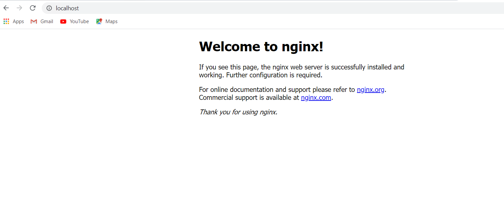

Lab 7: Installing Docker
==========================


1.  [Download Docker](https://docs.docker.com/desktop/windows/install/).
2.  Double-click downloaded file to run the installer.
3.  Follow the Install Wizard: accept the license, authorize the installer, and proceed with the install.
4.  Click Finish to launch Docker.
5.  Docker starts automatically.
6.  Docker loads a "Welcome" window giving you tips and access to the Docker documentation.

That’s it!

Verification
------------

The whale in the status bar indicates a running (and accessible via
terminal) Docker instance.

Open PowerShell or your favorite Windows terminal (e.g., Command prompt)
and enter `docker run hello-world`.

Windows prompts you for access every time Docker starts, allowing Docker
to manage the Hyper-V VM’s. The *first time* Docker starts, you may need
to provide the token from the Beta invitation email. When initialization
completes, select **About Docker** from the notification area and verify
you have the latest version.

From PowerShell (or your favorite Windows terminal), check the versions
of `docker`, `docker-compose`,
and verify your installation:

```
PS C:\Users\fenago> docker --version
PS C:\Users\fenago> docker-compose --version
```

Before you stop, let’s test a Dockerized webserver; from PowerShell or
cmd.exe, run:

```
docker run -d -p 80:80 --name webserver nginx
```

If your host does not already have it, Docker downloads
`nginx` from Docker Hub and starts it. As soon as
the download completes, point your web browser to
[http://localhost](http://localhost/) to view the start page. You should see:



